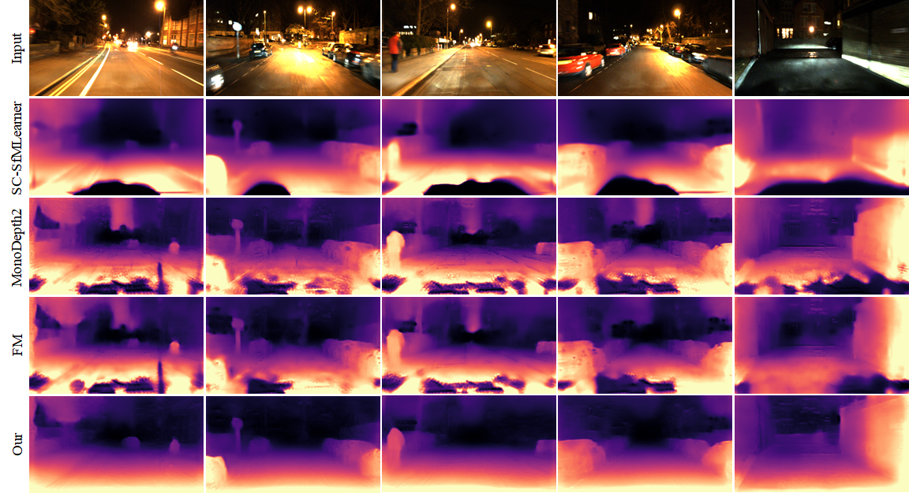

# Regularizing Nighttime Weirdness: Efficient Self-supervised Monocular Depth Estimation in the Dark
Kun Wang, Zhenyu Zhang, Zhiqiang Yan, Xiang Li, Baobei Xu, Jun Li and Jian Yang

PCA Lab, Nanjing University of Science and Technology; Tencent YouTu Lab; Hikvision Research Institute

## Introduction

This is the official repository for *Regularizing Nighttime Weirdness: Efficient Self-supervised Monocular Depth Estimation in the Dark*. You can find our paper at [arxiv](https://arxiv.org/abs/2108.03830). In this repository, we release the training and testing code, as well as the data split files of RobotCar-Night and nuScenes-Night.



## Dependency

- python>=3.6
- torch>=1.7.1
- torchvision>=0.8.2
- mmcv>=1.3
- pytorch-lightning>=1.4.5
- opencv-python>=3.4
- tqdm>=4.53

## Dataset

The dataset used in our work is based on [RobotCar](https://github.com/ori-mrg/robotcar-dataset-sdk) and [nuScenes](https://github.com/nutonomy/nuscenes-devkit). Please visit their official website to download the data (We only used a part of these datasets. If you just want to run the code, `(2014-12-16-18-44-24, 2014-12-09-13-21-02)` of RobotCar and `(Package 01, 02, 05, 09, 10)` of nuScenes is enough). To produce the ground truth depth, you can use the above official toolboxes. After preparing datasets, we strongly recommend you to organize the directory structure as follows. The split files are provided in `split_files/`.

```
RobotCar-Night root directory
|__Package name (e.g. 2014-12-16-18-44-24)
   |__depth (to store the .npy ground truth depth maps)
      |__ground truth depth files
   |__rgb (to store the .png color images)
      |__color image files
   |__intrinsic.npy (to store the camera intrinsics)
   |__test_split.txt (to store the test samples)
   |__train_split.txt (to store the train samples)
```

```
nuScenes-Night root directory
|__sequences (to store sequence data)
   |__video clip number (e.g. 00590cbfa24a430a8c274b51e1c71231)
      |__file_list.txt (to store the image file names in this video clip)
      |__intrinsic.npy (to store the camera intrinsic of this video clip)
      |__image files described in file_list.txt
|__splits (to store split files)
   |__split files with name (day/night)_(train/test)_split.txt
|__test
   |__color (to store color images for testing)
   |__gt (to store ground truth depth maps w.r.t color)
```

**Note**: You also need to configure the dataset path in `datasets/common.py`. The original resolution of nuScenes is too high, so we reduce its resolution to half when training.

## Training

Our model is trained using Distributed Data Parallel supported by [Pytorch-Lightning](https://github.com/PyTorchLightning/pytorch-lightning). You can train a RNW model on one dataset through the following two steps:

1. Train a self-supervised model on daytime data, by

   ```shell
   python train.py mono2_(rc/ns)_day number_of_your_gpus
   ```

2. Train RNW by

   ```shell
   python train.py rnw_(rc/ns) number_of_your_gpus
   ```

Since there is no eval split, checkpoints will be saved every two epochs.

## Testing

You can run the following commands to test on RobotCar-Night

```shell
python test_robotcar_disp.py day/night config_name checkpoint_path
cd evaluation
python eval_robotcar.py day/night
```

To test on nuScenes-Night, you can run

```shell
python test_nuscenes_disp.py day/night config_name checkpoint_path
cd evaluation
python eval_nuscenes.py day/night
```

Besides, you can use the scripts `batch_eval_robotcar.py` and `batch_eval_nuscenes.py` to automatically execute the above commands.

## Citation

If you find our work useful, please consider citing our paper

```tex
@InProceedings{Wang_2021_ICCV,
    author    = {Wang, Kun and Zhang, Zhenyu and Yan, Zhiqiang and Li, Xiang and Xu, Baobei and Li, Jun and Yang, Jian},
    title     = {Regularizing Nighttime Weirdness: Efficient Self-Supervised Monocular Depth Estimation in the Dark},
    booktitle = {Proceedings of the IEEE/CVF International Conference on Computer Vision (ICCV)},
    month     = {October},
    year      = {2021},
    pages     = {16055-16064}
}
```


